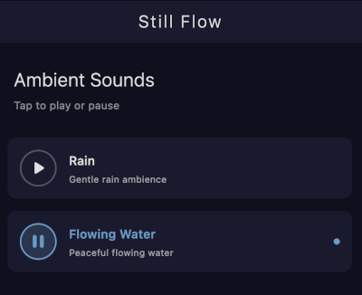

# StillFlow

An open-source Flutter sleep and meditation sounds app that brings nature's most calming audio directly to your device with seamless media controls and complete offline functionality.



## Status

I built this in less than a day. Publishing to Github is a good stopping point. Publishing to the app stores is a task for the future.

## Features

- 🌧️ **Ambient Sounds** - Rain and flowing water with true gapless looping
- 🌙 **Dark Theme** - Sleep-friendly interface with warm, low-brightness colors
- 🔄 **Background Playback** - Audio continues when app is minimized or screen is locked
- 📱 **Media Controls** - Play/pause from notification (Android) or Control Center (iOS/macOS)
- 🔇 **Completely Offline** - No internet connection required
- 🔒 **Privacy First** - Zero data collection, no analytics, no ads
- 🎵 **Gapless Looping** - Powered by flutter_soloud for seamless, low-latency audio

## Getting Started

### Prerequisites

- [Flutter SDK](https://flutter.dev/docs/get-started/install) (3.9.2 or higher)
- [Dart SDK](https://dart.dev/get-dart) (included with Flutter)
- For Android: Android Studio or VS Code with Flutter extension
- For iOS: Xcode (macOS only)

### Installation

1. Clone the repository:
   ```bash
   git clone https://github.com/13rac1/StillFlow.git
   cd StillFlow
   ```

2. Install dependencies:
   ```bash
   flutter pub get
   ```

3. Run the app:
   ```bash
   # For Android
   flutter run

   # For iOS (macOS only)
   flutter run -d ios

   # For a specific device
   flutter devices
   flutter run -d <device-id>
   ```

### Building for Release

**Android:**
```bash
flutter build apk --release
# APK will be at: build/app/outputs/flutter-apk/app-release.apk
```

**iOS:**
```bash
flutter build ios --release
# Open ios/Runner.xcworkspace in Xcode to archive and export
```

**macOS:**
```bash
flutter build macos --release
# App will be at: build/macos/Build/Products/Release/StillFlow.app
```

## Running Tests

```bash
# Run all tests
flutter test

# Run tests with coverage
flutter test --coverage

# Run specific test file
flutter test test/models/sound_test.dart
```

## Development Testing

### Testing on Android Device

1. **Enable Developer Options:**
   - Go to Settings → About Phone
   - Tap "Build Number" 7 times until you see "You are now a developer"

2. **Enable USB Debugging:**
   - Go to Settings → Developer Options
   - Enable "USB Debugging"

3. **Connect and verify device:**
   ```bash
   # Connect via USB cable
   # On your device, approve the "Allow USB debugging" prompt

   # Verify device is connected
   flutter devices
   ```

4. **Run the app:**
   ```bash
   flutter run
   # Or specify device if you have multiple
   flutter run -d <device-id>
   ```

### Testing Background Audio

Once running on device, verify the core functionality:

1. **Play a sound** - Tap Rain or Flowing Water
2. **Test background playback** - Press home button → verify audio continues
3. **Test lock screen** - Lock device → verify audio continues
4. **Test notification controls** - Check notification panel → tap play/pause
5. **Test seamless looping** - Let audio play for several minutes to verify no gaps

### Troubleshooting

**Device not showing?**
```bash
# Check ADB connection
flutter doctor -v

# Restart ADB server
adb kill-server
adb start-server
adb devices
```

**Build fails?**
```bash
# Clean and rebuild
flutter clean
flutter pub get
flutter run
```

## Project Structure

```
lib/
├── main.dart                 # App entry point
├── models/
│   └── sound.dart           # Sound data model
├── screens/
│   └── home_screen.dart     # Main screen with audio controls
├── services/
│   ├── audio_handler.dart   # Audio service handler for media controls
│   └── audio_service.dart   # flutter_soloud audio engine wrapper
└── widgets/
    └── sound_tile.dart      # Sound selection tile widget

assets/
├── audio/                    # Ambient sound loops (.ogg format)
└── images/                   # App icons and branding

test/
├── models/
├── screens/
├── services/
└── widgets/
```

## Audio Files

The app includes ambient sound loops in `assets/audio/`:
- Rain sounds - Gentle rain ambience (OGG format, 5.7MB)
- Flowing water - Peaceful stream sounds (OGG format, 5.5MB)

Audio files use OGG Vorbis format for:
- High quality compression
- Gapless looping support
- Cross-platform compatibility

Total app size: ~15MB with audio assets and icons

## Platform Support

### Tested & Working
- ✅ **Android 6.0+** (API level 23) - Full media controls and background playback
- ✅ **iOS 12.0+** - Control Center integration and background audio
- ✅ **macOS 10.14+** - Native desktop experience with media controls

### Not Supported
- ❌ **Web** - Background audio limitations in browsers
- ❌ **Windows/Linux** - Desktop platforms not currently supported

## License

This project is licensed under the AGPL-3.0 License - see the [LICENSE](LICENSE.txt) file for details.

## Contributing

Contributions are welcome! Please feel free to submit a Pull Request.

## Technical Details

### Audio Engine
- **flutter_soloud** - Low-latency, gapless audio playback with native SoLoud integration
- **audio_service** - System integration for media controls and notifications
- **audio_session** - Audio focus and session management

### Key Features
- True gapless looping at the native level (no gaps between loop points)
- Low-latency audio playback for responsive controls
- Background audio support with proper session management
- Media controls integration (notifications, lock screen, Control Center)
- Proper audio focus handling (pauses when other apps need audio)

## Acknowledgments

- Audio files sourced from royalty-free libraries
- Built with [Flutter](https://flutter.dev)
- Audio powered by [flutter_soloud](https://pub.dev/packages/flutter_soloud) and [audio_service](https://pub.dev/packages/audio_service)
- App icon: Custom water drop with ripples design
